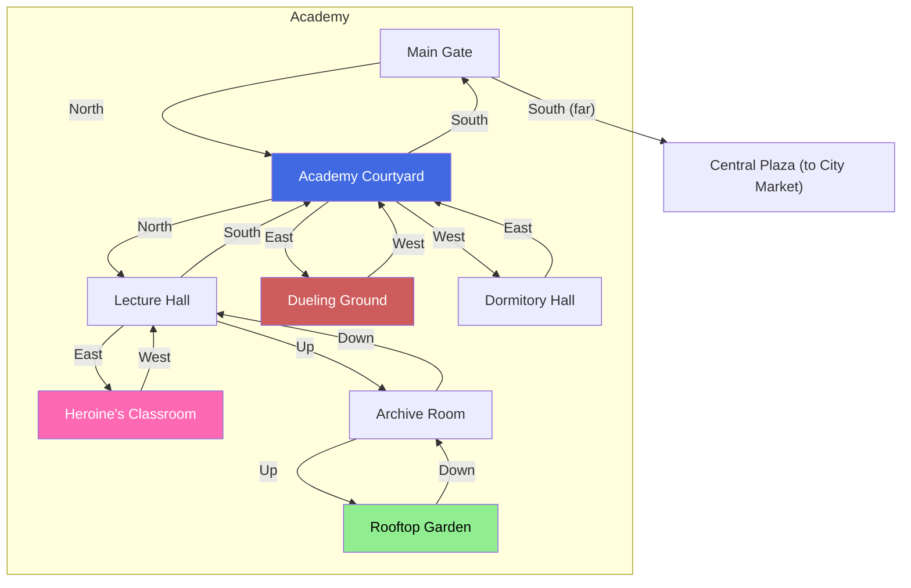

# Academy

## Room Details

| Room | ID | Travel Time | Exits | Features |
|------|----|------------|-------|----------|
| Main Gate | academy_main_gate | 2 min | N -> Courtyard | Entrance, gate guard, bulletin board, exit to City |
| Academy Courtyard | academy_courtyard | 3 min | S -> Gate, N -> Lecture Hall, E -> Dueling, W -> Dormitory | Open area, students socializing, fountain |
| Lecture Hall | academy_lecture_hall | 2 min | S -> Courtyard, E -> Heroine's Classroom, Up -> Archive | Classes in session, professor NPC, intel on Elena |
| Dueling Ground | academy_dueling_ground | 3 min | W -> Courtyard | Practice swords, challenge rivals, reputation events |
| Dormitory Hall | academy_dormitory | 2 min | E -> Courtyard | Student rooms, gossip, sleep (if enrolled) |
| Heroine's Classroom | academy_heroine_classroom | 2 min | W -> Lecture Hall | Elena's study space, her notes, social sabotage |
| Archive Room | academy_archive | 3 min | Down -> Lecture Hall, Up -> Rooftop | Historical records, blackmail material, restricted texts |
| Rooftop Garden | academy_rooftop_garden | 2 min | Down -> Archive | Quiet spot, secret meetings, scenic overlook |
