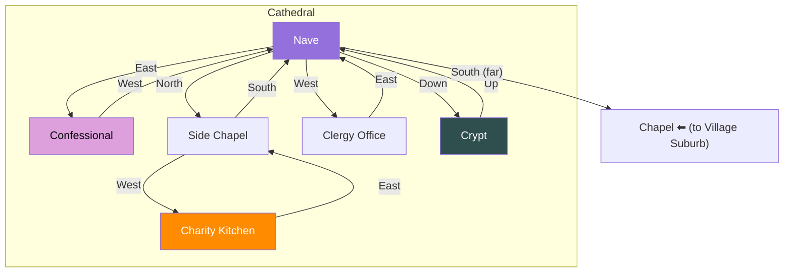

# Cathedral

## Room Details

| Room | ID | Travel Time | Exits | Features |
|------|----|------------|-------|----------|
| Nave | cathedral_nave | 3 min | E -> Confessional, N -> Side Chapel, W -> Clergy Office, Down -> Crypt | Main hall, pews, stained glass, priest NPC |
| Confessional | cathedral_confessional | 1 min | W -> Nave | Overhear secrets, confess sins (lower suspicion), private |
| Side Chapel | cathedral_side_chapel | 2 min | S -> Nave, W -> Charity Kitchen | Quiet prayer, votive candles, hidden messages |
| Clergy Office | cathedral_clergy_office | 2 min | E -> Nave | Bishop NPC, church records, favors for donations |
| Crypt | cathedral_crypt | 4 min | Up -> Nave | Ancient tombs, hidden passages, dark secrets |
| Charity Kitchen | cathedral_charity_kitchen | 2 min | E -> Side Chapel | Feed the poor, gain reputation, commoner intel |
