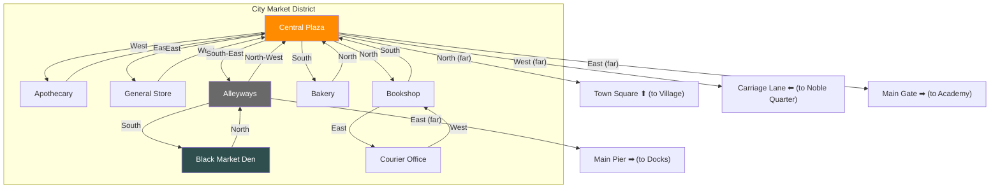

# City Market District

## Room Details

| Room | ID | Travel Time | Exits | Features |
|------|----|------------|-------|----------|
| Central Plaza | city_central_plaza | 3 min | N -> Bookshop, S -> Bakery, E -> General Store, W -> Apothecary, SE -> Alleyways | Main hub, fountain, criers, area transitions |
| Apothecary | city_apothecary | 2 min | E -> Central Plaza | Potions, herbs, poison ingredients, alchemist NPC |
| General Store | city_general_store | 2 min | W -> Central Plaza | Tools, rope, lanterns, general supplies |
| Bookshop | city_bookshop | 2 min | S -> Central Plaza, E -> Courier Office | Rare texts, lore books, scholar NPC |
| Bakery | city_bakery | 2 min | N -> Central Plaza | Fresh bread, pastries, food supplies, friendly baker |
| Alleyways | city_alleyways | 3 min | NW -> Central Plaza, S -> Black Market | Dark, thieves, rats, exit to Docks |
| Black Market Den | city_black_market | 4 min | N -> Alleyways | Illegal goods, forged documents, hired thugs, fence NPC |
| Courier Office | city_courier | 2 min | W -> Bookshop | Send/receive letters, intercept messages, clerk NPC |
