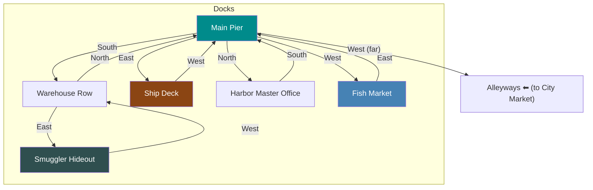

# Docks

## Room Details

| Room | ID | Travel Time | Exits | Features |
|------|----|------------|-------|----------|
| Main Pier | docks_main_pier | 3 min | S -> Warehouses, E -> Ship, N -> Harbor Master, W -> Fish Market | Harbor hub, sailors, ships, salt air |
| Warehouse Row | docks_warehouses | 3 min | N -> Main Pier, E -> Smuggler Hideout | Stacked crates, dockworkers, suspicious activity |
| Smuggler Hideout | docks_smuggler_hideout | 4 min | W -> Warehouses | Illegal goods, escape route, underworld contacts |
| Ship Deck | docks_ship_deck | 2 min | W -> Main Pier | Merchant vessel, captain NPC, potential escape |
| Harbor Master Office | docks_harbor_master | 2 min | S -> Main Pier | Shipping manifests, harbor master NPC, intel |
| Fish Market | docks_fish_market | 2 min | E -> Main Pier | Fresh catch, commoner gossip, cheap food |
