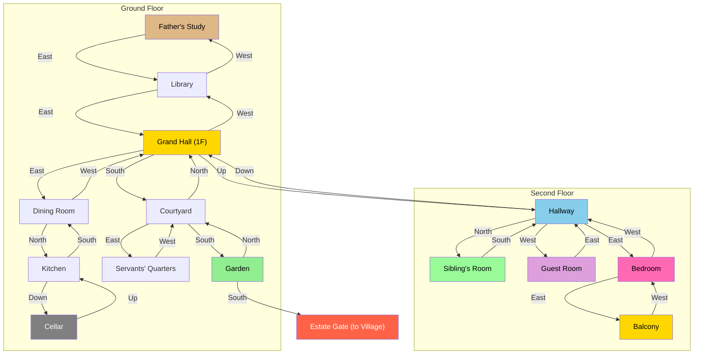

# Ducal Estate - Ground Floor (1F)

## Room Details

| Room | Travel Time | Key Features |
|------|------------|--------------|
| Grand Hall | 4 min | Central hub, chandelier, social area. Stairs up to 2F. |
| Library | 2 min | Books, reading nook, connects Study and Grand Hall. |
| Father's Study | 2 min | Duke's desk, maps, locked documents. Dead end west. |
| Dining Room | 2 min | Formal meals, place cards, leads to Kitchen. |
| Kitchen | 2 min | Chef Marcel's domain, locked cabinet. Stairs to Cellar. |
| Cellar | 3 min | Wine storage, poison, hidden passage hints. |
| Courtyard | 5 min | Guard patrols, fountain, main outdoor hub. |
| Servants' Quarters | 3 min | Staff quarters, gossip, duty roster. |
| Garden | 8 min | Gardener Thorne, hedge maze, nightshade. Exit to Village. |
