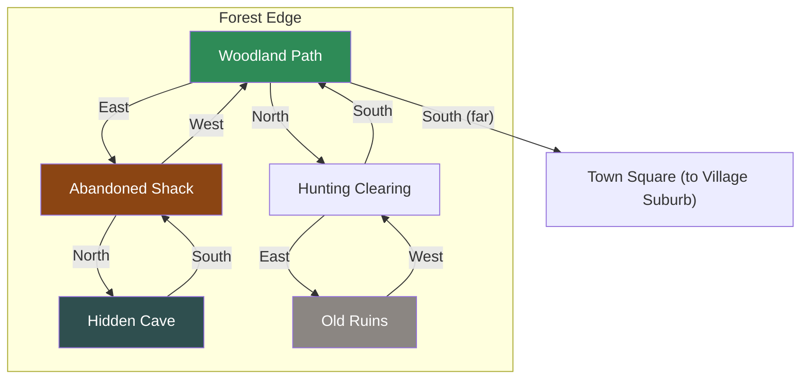

# Forest Edge

## Room Details

| Room | ID | Travel Time | Exits | Features |
|------|----|------------|-------|----------|
| Woodland Path | forest_woodland_path | 4 min | N -> Clearing, E -> Shack | Forest entrance, birdsong, herb gathering |
| Hunting Clearing | forest_hunting_clearing | 3 min | S -> Woodland, E -> Old Ruins | Open glade, animal tracks, hunter's camp |
| Abandoned Shack | forest_abandoned_shack | 3 min | W -> Woodland, N -> Hidden Cave | Dilapidated shelter, old supplies, squatters |
| Hidden Cave | forest_hidden_cave | 5 min | S -> Shack | Secret refuge, hidden cache, ancient markings |
| Old Ruins | forest_old_ruins | 4 min | W -> Clearing | Crumbling stone, forgotten shrine, lore artifacts |
