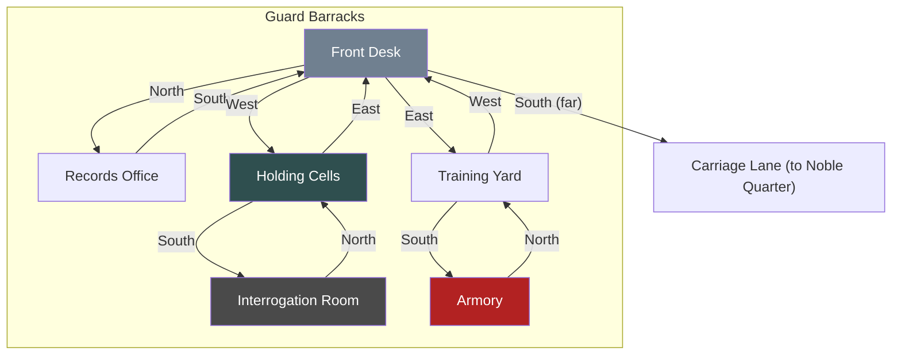

# Guard Barracks

## Room Details

| Room | ID | Travel Time | Exits | Features |
|------|----|------------|-------|----------|
| Front Desk | barracks_front_desk | 2 min | N -> Records, W -> Cells, E -> Training | Reception, guard captain, report crimes |
| Records Office | barracks_records | 2 min | S -> Front Desk | Criminal records, investigation files, blackmail intel |
| Holding Cells | barracks_cells | 2 min | E -> Front Desk, S -> Interrogation | Prisoners, bribe guards, plant evidence |
| Interrogation Room | barracks_interrogation | 2 min | N -> Holding Cells | Questioning, extract confessions, intimidation |
| Training Yard | barracks_training | 3 min | W -> Front Desk, S -> Armory | Guards sparring, practice combat, reputation |
| Armory | barracks_armory | 2 min | N -> Training Yard | Weapons, confiscated items, restricted access |
