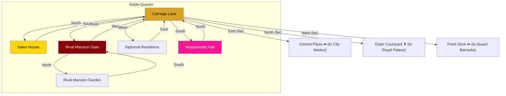

# Noble Quarter

## Room Details

| Room | ID | Travel Time | Exits | Features |
|------|----|------------|-------|----------|
| Carriage Lane | noble_carriage_lane | 3 min | N -> Salon, E -> Rival Gate, W -> Diplomat, S -> Masquerade | Hub street, carriages, area transitions |
| Salon House | noble_salon | 2 min | S -> Carriage Lane | Tea parties, social scheming, noble gossip NPC |
| Rival Mansion Gate | noble_rival_gate | 2 min | W -> Carriage Lane, N -> Rival Garden | Rival family's estate entrance, guards |
| Rival Mansion Garden | noble_rival_garden | 3 min | S -> Rival Gate | Eavesdrop on rivals, secret rendezvous |
| Diplomat Residence | noble_diplomat | 2 min | E -> Carriage Lane | Foreign ambassador, political favors, letters |
| Masquerade Hall | noble_masquerade_hall | 3 min | N -> Carriage Lane | Balls, disguised scheming, anonymity, dance events |
