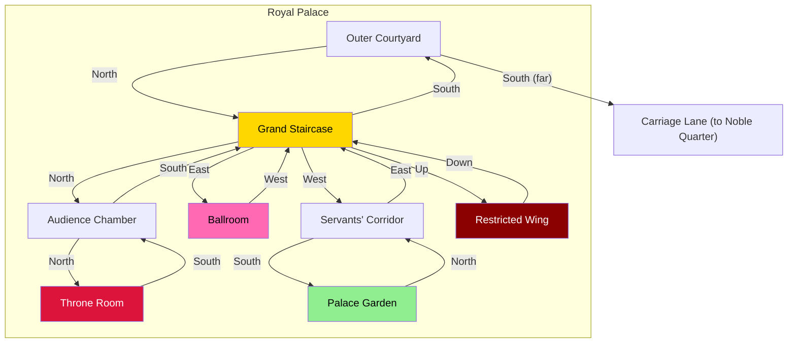

# Royal Palace

## Room Details

| Room | ID | Travel Time | Exits | Features |
|------|----|------------|-------|----------|
| Outer Courtyard | palace_outer_courtyard | 4 min | N -> Grand Staircase | Palace entrance, royal guards, impressive architecture |
| Grand Staircase | palace_grand_staircase | 3 min | S -> Outer Court, N -> Audience, E -> Ballroom, W -> Servants' Corridor, Up -> Restricted | Central hub, ornate marble stairs |
| Throne Room | palace_throne_room | 2 min | S -> Audience Chamber | The King's seat, formal audiences, endgame events |
| Audience Chamber | palace_audience_chamber | 3 min | N -> Throne Room, S -> Grand Staircase | Petitions, Prince NPC, political maneuvering |
| Ballroom | palace_ballroom | 3 min | W -> Grand Staircase | Grand dances, social competition, Elena encounters |
| Servants' Corridor | palace_servants_corridor | 2 min | E -> Grand Staircase, S -> Palace Garden | Servant gossip, hidden routes, intel |
| Restricted Wing | palace_restricted_wing | 4 min | Down -> Grand Staircase | Royal secrets, forbidden documents, high suspicion |
| Palace Garden | palace_garden | 3 min | N -> Servants' Corridor | Royal gardens, private conversations, romantic scenes |
