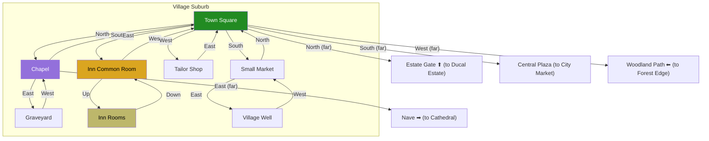

# Village Suburb

## Room Details

| Room | ID | Travel Time | Exits | Features |
|------|----|------------|-------|----------|
| Town Square | village_town_square | 3 min | N -> Chapel, S -> Market, E -> Inn, W -> Tailor | Central hub, notice board, gossip, carriage to Estate |
| Chapel | village_chapel | 2 min | S -> Town Sq, E -> Graveyard | Prayer, priest NPC, exit to Cathedral |
| Graveyard | village_graveyard | 3 min | W -> Chapel | Quiet, hidden items, lore |
| Inn Common Room | village_inn | 2 min | W -> Town Sq, Up -> Inn Rooms | Drinks, rumors, travelers, bard |
| Inn Rooms | village_inn_rooms | 1 min | Down -> Inn Common | Sleep allowed, eavesdrop |
| Tailor Shop | village_tailor | 2 min | E -> Town Sq | Disguises, clothing, NPC tailor |
| Small Market | village_market | 2 min | N -> Town Sq, E -> Well | Food stalls, merchants, supplies |
| Village Well | village_well | 2 min | W -> Market | Meeting point, overheard secrets |
