# World Map - Villainess of the Empire

```mermaid
graph TD
    subgraph The World
        DE["🏰 Ducal Estate"]
        VS["🏘️ Village Suburb"]
        CMD["🏪 City Market District"]
        AC["📚 Academy"]
        CT["⛪ Cathedral"]
        NQ["👑 Noble Quarter"]
        RP["🏛️ Royal Palace"]
        GB["⚔️ Guard Barracks"]
        DK["⚓ Docks"]
        FE["🌲 Forest Edge"]
    end

    DE -->|"Estate Gate  ->  Town Square\n(carriage, 20 min)"| VS
    VS -->|"Town Square  ->  Estate Gate\n(carriage, 20 min)"| DE

    VS -->|"Town Square  ->  Central Plaza\n(walk, 15 min)"| CMD
    CMD -->|"Central Plaza  ->  Town Square\n(walk, 15 min)"| VS

    VS -->|"Chapel  ->  Nave\n(walk, 5 min)"| CT
    CT -->|"Nave  ->  Chapel\n(walk, 5 min)"| VS

    VS -->|"Town Square  ->  Woodland Path\n(walk, 10 min)"| FE
    FE -->|"Woodland Path  ->  Town Square\n(walk, 10 min)"| VS

    CMD -->|"Central Plaza  ->  Carriage Lane\n(walk, 10 min)"| NQ
    NQ -->|"Carriage Lane  ->  Central Plaza\n(walk, 10 min)"| CMD

    CMD -->|"Central Plaza  ->  Main Gate\n(walk, 8 min)"| AC
    AC -->|"Main Gate  ->  Central Plaza\n(walk, 8 min)"| CMD

    CMD -->|"Alleyways  ->  Main Pier\n(walk, 5 min)"| DK
    DK -->|"Main Pier  ->  Alleyways\n(walk, 5 min)"| CMD

    NQ -->|"Carriage Lane  ->  Outer Courtyard\n(carriage, 10 min)"| RP
    RP -->|"Outer Courtyard  ->  Carriage Lane\n(carriage, 10 min)"| NQ

    NQ -->|"Carriage Lane  ->  Front Desk\n(walk, 5 min)"| GB
    GB -->|"Front Desk  ->  Carriage Lane\n(walk, 5 min)"| NQ

    style DE fill:#8B4513,color:#fff
    style VS fill:#228B22,color:#fff
    style CMD fill:#FF8C00,color:#fff
    style AC fill:#4169E1,color:#fff
    style CT fill:#9370DB,color:#fff
    style NQ fill:#DAA520,color:#fff
    style RP fill:#DC143C,color:#fff
    style GB fill:#708090,color:#fff
    style DK fill:#008B8B,color:#fff
    style FE fill:#2E8B57,color:#fff
```

## Area Overview

| Area | Rooms | Role in Story | Access From |
|------|-------|--------------|-------------|
| Ducal Estate | 14 | Starting area, home base, Elena's lodging | Village Suburb |
| Village Suburb | 8 | Local village, inn, shops, gossip | Estate, City, Cathedral, Forest |
| City Market District | 8 | Commerce hub, information, black market | Village, Noble Quarter, Academy, Docks |
| Academy | 8 | Elena's school, social competition, intel | City Market |
| Cathedral | 6 | Sanctuary, confessions, clergy influence | Village Suburb |
| Noble Quarter | 6 | High society, rivals, political maneuvering | City Market, Royal Palace, Guard Barracks |
| Royal Palace | 8 | Royal court, Prince, endgame events | Noble Quarter |
| Guard Barracks | 6 | Law enforcement, records, imprisonment | Noble Quarter |
| Docks | 6 | Smuggling, escape routes, underworld | City Market |
| Forest Edge | 5 | Wilderness, secrets, hidden refuge | Village Suburb |

## Travel Time Matrix (approximate minutes between area hubs)

| From \ To | Estate | Village | City | Academy | Cathedral | Noble | Palace | Barracks | Docks | Forest |
|-----------|--------|---------|------|---------|-----------|-------|--------|----------|-------|--------|
| Estate | - | 20 | 35 | 43 | 25 | 45 | 55 | 50 | 40 | 30 |
| Village | 20 | - | 15 | 23 | 5 | 25 | 35 | 30 | 20 | 10 |
| City | 35 | 15 | - | 8 | 20 | 10 | 20 | 15 | 5 | 25 |
